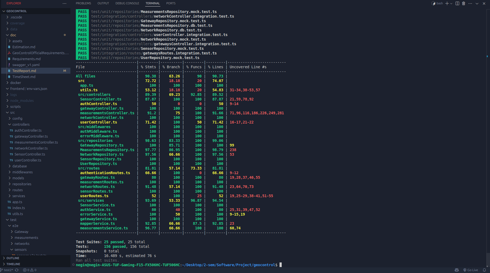

# Test Report

The goal of this document is to explain how the application was tested, detailing how the test cases were defined and what they cover.

# Contents

- [Test Report](#test-report)  
- [Contents](#contents)  
- [Dependency graph](#dependency-graph)  
- [Integration approach](#integration-approach)  
- [Tests](#tests)  
- [Coverage](#coverage)  
  - [Coverage of FR](#coverage-of-fr)  
  - [Coverage white box](#coverage-white-box)

# Dependency graph

The application is structured as follows:

```
app.ts
 ├─ src/routes/
 │    ├─ authenticationRoutes.ts
 │    ├─ gatewayRoutes.ts
 │    ├─ measurementRoutes.ts
 │    ├─ networkRoutes.ts
 │    ├─ sensorRoutes.ts
 │    └─ userRoutes.ts
 ├─ src/controllers/
 │    ├─ AuthController.ts
 │    ├─ GatewayController.ts
 │    ├─ MeasurementsController.ts
 │    ├─ NetworkController.ts
 │    ├─ SensorController.ts
 │    └─ UserController.ts
 ├─ src/services/
 │    ├─ authService.ts
 │    ├─ gatewayService.ts
 │    ├─ measurementsService.ts
 │    ├─ mapperService.ts
 │    ├─ errorService.ts
 │    └─ SensorService.ts
 ├─ src/repositories/
 │    ├─ UserRepository.ts
 │    ├─ GatewayRepository.ts
 │    ├─ MeasurementsRepository.ts
 │    ├─ NetworkRepository.ts
 │    └─ SensorRepository.ts
 ├─ src/middlewares/
 │    ├─ authMiddleware.ts
 │    └─ errorMiddleware.ts
 └─ src/utils.ts
```

# Integration approach

We adopted a **mixed (bottom-up then top-down)** strategy:

1. **Step 1 (Unit tests):**  
   – Test each repository in isolation against an in-memory or test database.  
2. **Step 2 (Unit tests):**  
   – Test service layer with mocked repositories.  
3. **Step 3 (Integration tests):**  
   – Wire up controllers to real database via the test-datasource and run controller methods.  
4. **Step 4 (API tests):**  
   – Validate Express routes/endpoints using Supertest and Postman Collection.  
5. **Step 5 (End-to-End):**  
   – Full workflow tests hitting `app.ts`, from HTTP request down to repository and back.

# Tests

| Test case name             | Object(s) tested                             | Test level  | Technique                      |
|:--------------------------:|:---------------------------------------------:|:-----------:|:------------------------------:|
| Utils functions            | `utils.ts`                                    | Unit        | White-box (statement)          |
| Repository CRUD operations | Each `*Repository.ts`                         | Unit        | White-box (branch)             |
| Service business logic     | Each `*Service.ts`                            | Unit        | White-box (branch)             |
| Controller methods         | Each `*Controller.ts`                         | Integration | Black-box (equivalence)        |
| Route endpoints            | All `*.ts` in `src/routes`                    | API         | Black-box (boundary)           |
| Middleware error handling  | `authMiddleware.ts`/`errorMiddleware.ts`      | Integration | White-box (statement)          |
| Postman API collection     | Full REST suite                               | API         | Black-box (scenario)           |

# Coverage

## Coverage of FR

| Functional Requirement or scenario | Test(s)                                 |
|:---------------------------------:|:---------------------------------------:|
| FR1: User authentication          | Authentication routes + AuthController |
| FR2: Gateway management           | GatewayController + gatewayRoutes      |
| FR3: Measurement ingestion        | MeasurementsController + Postman tests |
| FR4: Sensor data retrieval        | SensorController + sensorRoutes        |
| FR5: Network topology             | NetworkController + networkRoutes      |
| FR6: User profile operations      | UserController + userRoutes            |

## Coverage white box

After running `npm test -- --coverage`, Jest reported:

| Metric      | %      |
|:-----------:|:------:|
| Statements  | 90.38% |
| Branches    | 63.26% |
| Functions   | 90.00% |
| Lines       | 90.73% |

Uncovered lines are detailed per file in the raw coverage report (see `/coverage/lcov-report/index.html`).

